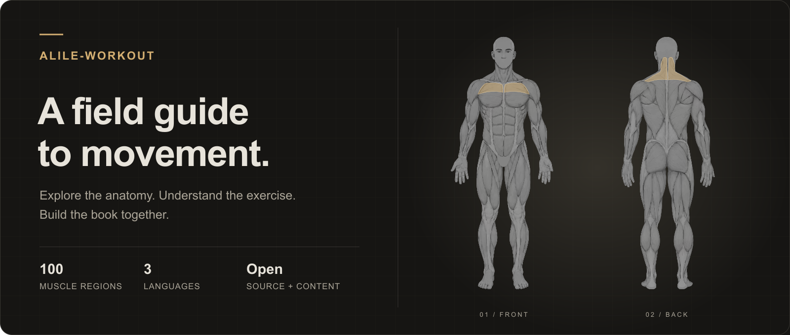

<a href="https://workout.alile.us">
  
</a>

<h1 align="center">alile-workout</h1>

<p align="center">
  An open muscle atlas and community workout book.<br />
  Choose what to train, explore the anatomy, and understand the movements behind it.
</p>

<p align="center">
  <a href="https://github.com/alileus/alile-workout/actions/workflows/ci.yml"></a>
  <a href="LICENSE"></a>
  <a href=".nvmrc"></a>
  <a href="CONTRIBUTING.md"></a>
</p>

<p align="center">
  <a href="https://workout.alile.us/en"><strong>Explore the atlas</strong></a> ·
  <a href="https://workout.alile.us/ar">العربية</a> ·
  <a href="https://workout.alile.us/ja">日本語</a> ·
  <a href="https://workout.alile.us/en/design-system">Design system</a> ·
  <a href="CONTRIBUTING.md">Contribute</a>
</p>

## Start with a muscle. Follow the movement.

Training advice is easier to understand when you can see what it involves. This project connects an interactive anatomy drawing to practical exercise guides, with the source, content, and translations open to contribution.

- **Explore 100 muscle regions.** Browse Chest, Back, Shoulders, Arms, Core, and Legs, or select a region on the front/back anatomy.
- **Understand each exercise.** Find instructions, technique cues, and the other muscles involved.
- **Browse all 79 workouts.** Search the exercise catalog, filter by muscle group, and follow linked muscles. Each workout has a shared start/finish pencil illustration.
- **Share the exact muscle.** Every group and region has its own URL, localized metadata, and an anatomy-based social preview.
- **Read in three languages.** English, Arabic with RTL support, and Japanese cover the interface and all muscle guides.
- **Use it on any screen.** Responsive layouts, keyboard-accessible region selection, and a shared sketchbook-inspired design system.

Try [Chest → Clavicular head](https://workout.alile.us/en/muscles/chest/chest-clavicular-head), then switch views and explore.

## Help build the book

You do not need to write code to contribute. Coaches, athletes, translators, illustrators, and developers can all help improve it.

| I want to…                                   | Start here                                                                                                                                               |
| -------------------------------------------- | -------------------------------------------------------------------------------------------------------------------------------------------------------- |
| Correct a guide or suggest an exercise       | [Submit a workout book update](https://github.com/alileus/alile-workout/issues/new?template=book-update.yml)                                             |
| Improve English, Arabic, or Japanese wording | [Suggest a translation](https://github.com/alileus/alile-workout/issues/new?template=book-update.yml) or read the [content guide](docs/content-guide.md) |
| Improve the anatomy or visual design         | Read the [artwork guide](docs/artwork/README.md) and [design system](docs/design-system.md)                                                              |
| Fix a bug or build a feature                 | Read [CONTRIBUTING.md](CONTRIBUTING.md), then [browse issues](https://github.com/alileus/alile-workout/issues)                                           |

Every muscle guide also includes **Suggest an edit**, which opens a form with the relevant entry already filled in. A free GitHub account is required. Suggestions are reviewed before publication; accepted updates become versioned pull requests.

The book is a **community draft awaiting expert review**. Its 100 regions are not a claim of exhaustive anatomical coverage. Deep layers are schematic, and each entry includes references and review status. Evidence-backed corrections and fluent-speaker reviews are especially welcome.

## Run locally

Use **Node.js 24** and npm. No database, account, or application secrets are needed to run the app.

```sh
git clone https://github.com/alileus/alile-workout.git
cd alile-workout
npm ci
npm run dev
```

Open [localhost:3000](http://localhost:3000). Localized routes start at `/en`, `/ar`, and `/ja`.

| Command          | What it does                                                         |
| ---------------- | -------------------------------------------------------------------- |
| `npm run dev`    | Start the local development server                                   |
| `npm run check`  | Run formatting, lint, types, tests, and a production build           |
| `npm test`       | Check content, translations, routing, metadata, and anatomy geometry |
| `npm run format` | Format the project with Prettier                                     |
| `npm run build`  | Build the production app                                             |
| `npm start`      | Serve an existing production build                                   |

For a first PR, fork the repository, branch from `main`, make a focused change, and run `npm run check`. Include how you verified it. UI changes should work on mobile, with a keyboard, and in all three locales, including RTL.

## Inside the project

**Next.js App Router · React · TypeScript · Tailwind CSS · shadcn/ui · next-intl · Zod**

Features own their behavior and data; shared components and design tokens keep contributions consistent. Workout entries live in versioned JSON, separate from the anatomy illustration.

| Location                    | Responsibility                                                      |
| --------------------------- | ------------------------------------------------------------------- |
| `src/features/anatomy`      | Region selection, front/back views, geometry, and share routes      |
| `src/features/workout-book` | Content schema, locale-aware loader, and movement guides            |
| `content/book`              | Workout entries and complete Arabic/Japanese translations           |
| `src/components/ui`         | Reusable shadcn/ui primitives                                       |
| `src/app/globals.css`       | Shared visual tokens and responsive layout                          |
| `src/app`                   | Pages, metadata, social images, sitemap, and robots                 |
| `src/i18n` · `messages`     | Locale routing and interface translations                           |
| `public/anatomy`            | Pencil-style front/back SVG artwork                                 |
| `public/workouts`           | Shared two-pose workout SVGs                                        |
| `tests`                     | Content integrity, translation coverage, routes, and artwork checks |

[Architecture](docs/architecture.md) · [Design system](docs/design-system.md) · [Content guide](docs/content-guide.md) · [Artwork provenance & tooling](docs/artwork/README.md)

The banner uses the same anatomy vectors as the app. Rebuild it with `node scripts/create-readme-banner.mjs`.

## Releases

| Branch       | Environment       | URL                                            |
| ------------ | ----------------- | ---------------------------------------------- |
| `main`       | Preview / testing | [workout.alile.dev](https://workout.alile.dev) |
| `production` | Live              | [workout.alile.us](https://workout.alile.us)   |

Pull requests target `main`. Maintainers promote verified changes to `production` through a release PR; Vercel deploys pushes automatically. The preview is protected by Vercel sign-in. See the [deployment guide](docs/deployment.md) for configuration details.

Only production permits search indexing. Pages include canonical URLs, language alternatives, structured data, and dynamic social images. Preview and local builds use `noindex`.

## License & credits

[MIT](LICENSE) © alile-workout contributors. Contributions use the same license; linked third-party references retain their own licenses.

The pencil anatomy was generated with GPT Image, approved as a visual reference, and traced into SVG. Its source and rebuild instructions are documented in the [artwork guide](docs/artwork/README.md).

Built with care by [alileus](https://github.com/alileus) and [everyone who contributes](https://github.com/alileus/alile-workout/graphs/contributors).
